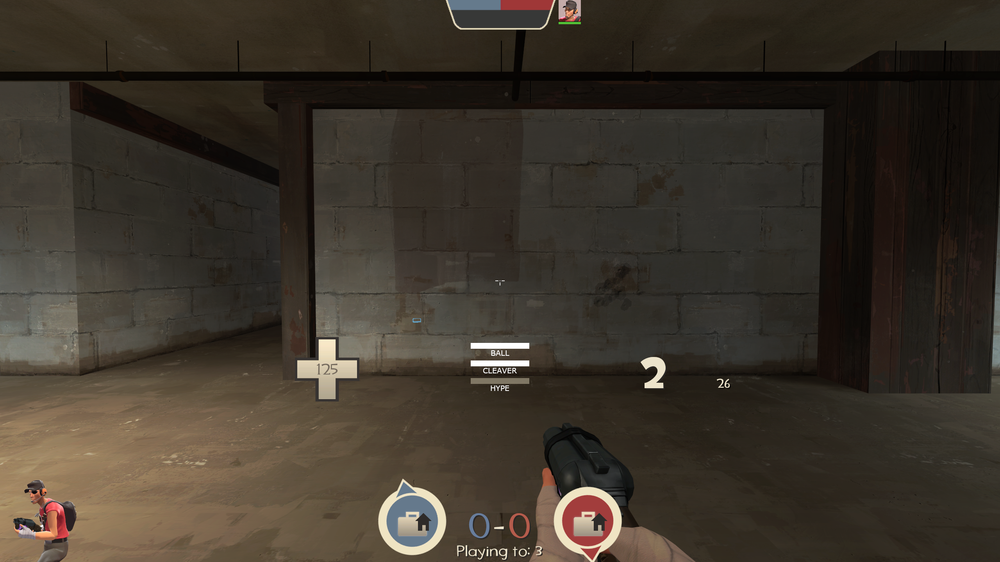
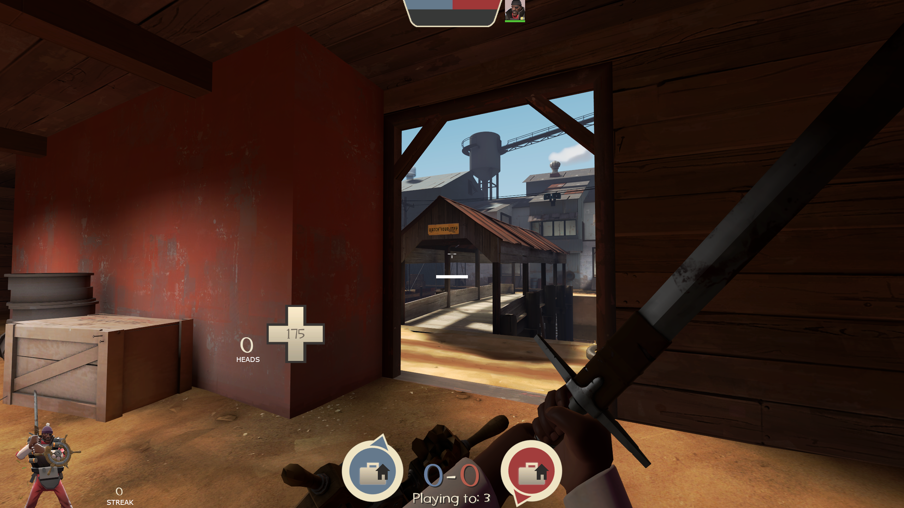
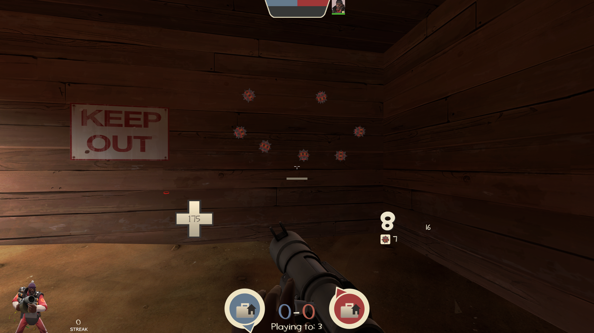
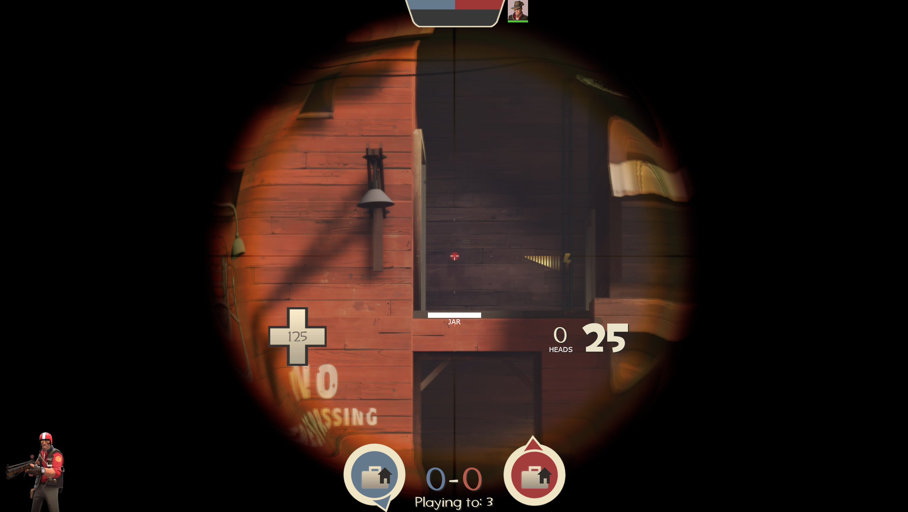
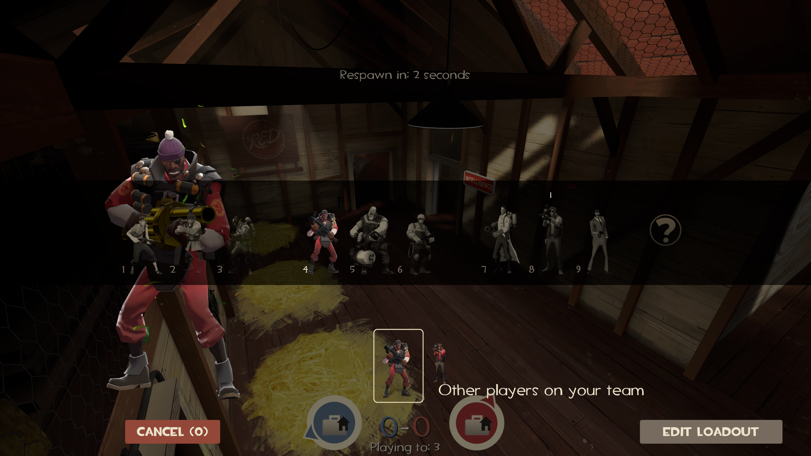
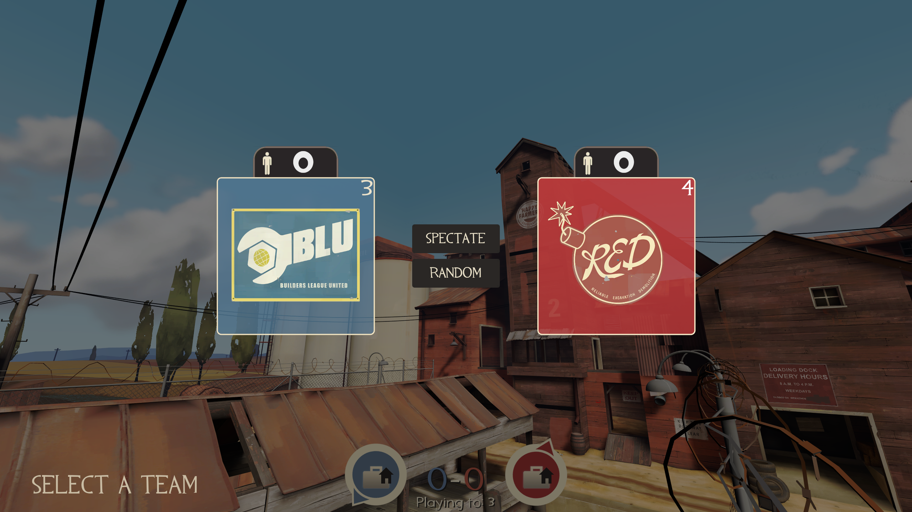

# Centered Default HUD
A TF2 hud that moves many elements close to the center of the screen because I have serious tunnel vision.

Uses Eniere's [Improved Default HUD](https://github.com/Eniere/idhud) as a base.

## Installation
* Remove/disable any other HUD mod you may have
* Go to the [releases](https://github.com/Sulfrix/centereddefault/releases) and download the latest one
* Extract the contained folder to your `tf/custom` folder
* **Make sure minmode is turned on (cl_hud_minmode 1)**

# Todo
- [ ] Clean up code
    - It's an absolute mess! This project jumbled network of hacks due to my lack of knowledge of how certain parts of VGUI and the resource system work. It also doesn't help that most of my design is purely focused on me.
- [ ] More testing on other setups (macOS, different resolutions, etc.)
- [ ] Remove minmode requirement
    - This mostly depends on if i can clean this code enough
- [ ] Custom arena mode team menu
- [ ] Publish to a hud website, like [comfig huds](https://mastercomfig.com/huds/2/)

And more...

# Screenshots
These screenshots were taken with a 1440p monitor. Some things like font sizes and rounded corners will look different at other resolutions but it's mostly consistent.

